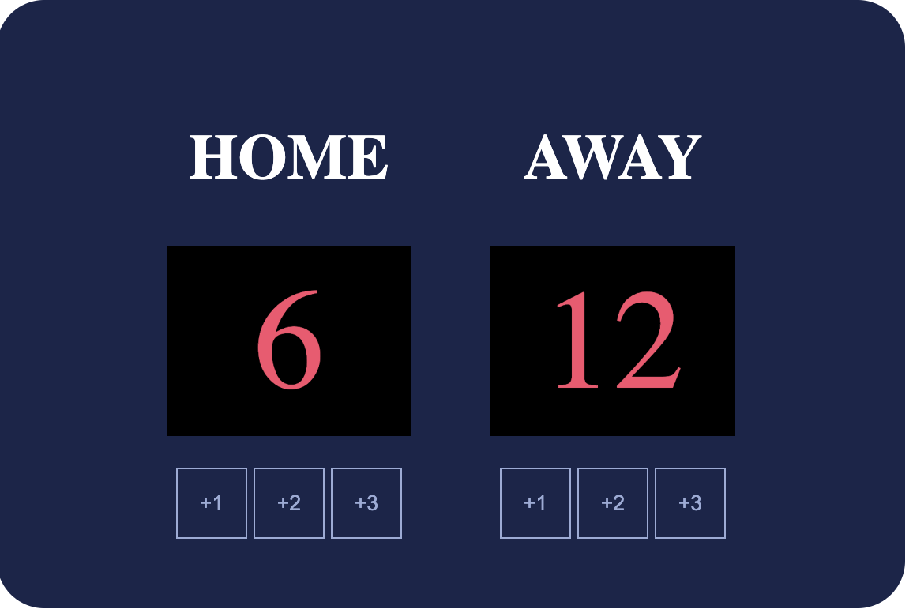

# scoreboard# 🏀 Basketball Scoreboard App

A simple basketball scoreboard built using **HTML, CSS, and JavaScript**.  
The main goal of this project was to practice **JavaScript fundamentals**, DOM manipulation, and debugging common issues when connecting JavaScript to HTML.

---

## 📸 Screenshot

## LIVE LINK DEMO
https://buildinrythm.github.io/scoreboard/

---

## 🚀 Features

- Home and Away scoreboards
- Buttons to increment scores by **+1, +2, and +3**
- Real-time score updates
- Clean, simple UI styled with CSS Flexbox

---

## 🧠 What I Learned

### 1. Connecting JavaScript to HTML
One of the biggest challenges was ensuring JavaScript functions were correctly called from the HTML. I encountered situations where clicking a button appeared to do nothing. These issues were caused by:

- Misspelled function names
- Forgetting to include parentheses when calling functions  
  (e.g. `onclick="increment1"` instead of `onclick="increment1()"`)
- JavaScript not being linked properly to the HTML file

This helped me understand how small syntax errors can completely stop JavaScript from running.

---

### 2. Understanding State vs UI Updates
I experienced an issue where button presses felt delayed. This happened because I was updating the UI **before** updating the score value.

I fixed this by:
1. Updating the score variable first  
2. Updating the DOM after the calculation  

This taught me the importance of **order of operations** when working with JavaScript and the DOM.

---

### 3. Using `.innerText` Correctly
Through this project, I became more confident using `.innerText` to update content dynamically on the page. I now understand when and how to update elements based on application state.

---

### 4. Choosing the Right HTML Elements
Initially, I used a `` element for the scoreboard, but found it difficult to style with a background and fixed size. I switched to using a `
`, which made styling much easier and gave me better control using CSS.

---

## 🛠️ Technologies Used

- HTML
- CSS (Flexbox)
- JavaScript (DOM manipulation)

---

## 📈 Future Improvements

- Add a reset button
- Highlight the team with the higher score
- Prevent negative scores
- Refactor JavaScript to reduce repetition
- Add animations or sound effects on score changes

---

## ✅ Status

This project is complete and served as a hands-on way to strengthen my JavaScript fundamentals and confidence when debugging.
